# Nimble Gravity — Fullstack Developer Challenge

A React mini-application that connects to the Nimble Gravity API, allowing candidates to identify themselves by email and submit their GitHub repository URL for an open position.

## Tech Stack

- **React 19** + **TypeScript 5**
- **Vite 7** with `@tailwindcss/vite` plugin
- **Tailwind CSS v4**

---

## Getting Started

```bash
# 1. Clone the repository
git clone https://github.com/ThiagoDelgado-D/nimble-gravity-challenge

# 2. Install dependencies
npm install

# 3. Set up environment variables
cp .env.example .env
# Edit .env and set VITE_API_BASE_URL

# 4. Run the dev server
npm run dev
```

### Environment Variables

| Variable | Description |
|---|---|
| `VITE_API_BASE_URL` | Base URL of the Nimble Gravity API |

---

## Approach & Thinking Process

Before writing a single line of code, the problem was analyzed across four dimensions:

### 1. Conceptual Flow

What does the user actually need to do, and in what order?

```mermaid
sequenceDiagram
    actor U as User
    participant A as React App
    participant API as Nimble Gravity API

    U->>A: Enters email
    A->>API: GET /api/candidate/get-by-email?email=...
    API-->>A: { uuid, candidateId, applicationId, ... }
    A->>A: Stores candidate in state

    A->>API: GET /api/jobs/get-list
    API-->>A: [{ id, title }, ...]
    A->>A: Renders job list

    U->>A: Types GitHub repo URL on a position
    U->>A: Clicks "Submit"
    A->>API: POST /api/candidate/apply-to-job
    Note over A,API: Body: uuid · candidateId · applicationId · jobId · repoUrl
    API-->>A: { ok: true }
    A->>U: Success feedback on that card
```



Two distinct phases emerge: **identity resolution** (step 1) and **job application** (step 2). This directly shaped the app's state machine — `step` is not stored separately, it's derived from `candidate !== null`.

### 2. Component Tree


### 3. Layer Responsibilities

Each layer has a strict contract: it only knows about the layer directly below it.

```mermaid
graph TD
    subgraph UI ["🎨  Presentation"]
        U1["App\nstep orchestration"]
        U2["EmailForm\nstep 1 — email input"]
        U3["JobItem\nstep 2 — card lifecycle"]
    end

    subgraph HOOKS ["🧠  Logic — hooks/"]
        H1["useAsync &lt;T&gt;\nloading · error · data · execute · reset"]
        H2["useCandidate\nwraps getCandidate · exposes fetch + reset"]
        H3["useJobs\nwraps getJobs · activates when enabled=true"]
        H4["useApply\nwraps applyToJob · derives ApplyStatus"]
    end

    subgraph API ["🌐  Network — api.ts"]
        A1["getCandidate(email)"]
        A2["getJobs()"]
        A3["applyToJob(payload)"]
        A4["request&lt;T&gt;\nparses error body · throws on non-ok"]
    end

    U1 -->|"candidate, loading, error"| H2
    U1 -->|"jobs, loading, error"| H3
    U3 -->|"status, error, submit"| H4

    H2 & H3 & H4 -->|built on| H1

    H2 --> A1
    H3 --> A2
    H4 --> A3

    A1 & A2 & A3 --> A4
```



| Layer | Knows about | Does NOT know about |
|---|---|---|
| `api.ts` | HTTP, fetch, error body parsing | React, component state |
| `hooks/` | `api.ts` functions, React state | UI structure, props |
| `components/` | Hook return values, props | How HTTP works |

### 4. Folder Structure

Components are grouped by **feature domain**, not by type. Each folder is a bounded context — you can understand a feature by reading one folder.

```
src/
├── api/
│   └── api.ts                  ← pure fetch, no React
├── hooks/
│   ├── useAsync.ts             ← generic async state
│   ├── useCandidate.ts
│   ├── useJobs.ts
│   └── useApply.ts
├── components/
│   ├── shared/                 ← reusable primitives (no domain)
│   │   ├── Icon.tsx
│   │   ├── StatusBadge.tsx
│   │   └── Stepper.tsx
│   ├── layout/
│   │   └── Header.tsx
│   ├── identify/               ← step 1 feature
│   │   └── EmailForm.tsx
│   └── jobs/                   ← step 2 feature
│       ├── JobList.tsx
│       ├── JobItem.tsx
│       ├── JobCardHeader.tsx
│       └── RepoSubmitForm.tsx
├── types/
│   └── index.ts
└── mocks/
    └── index.ts
```

---

## Design Principles Applied

### YAGNI — You Aren't Gonna Need It

The scope was deliberately minimal. No routing, no global state manager, no component library, no test setup. Every decision was evaluated against the question: *does this solve the actual problem?*

Examples of things explicitly **not** built:
- No Context or Zustand — `candidate` flows as props; the tree is shallow enough
- No React Query — `useAsync` handles the three use cases cleanly
- No form library — a single controlled input per form doesn't justify the overhead

### Single Responsibility

Each piece has one reason to change:

| Piece | Responsibility | Does NOT know about |
|---|---|---|
| `api.ts` | HTTP transport | React, state |
| `useAsync` | Loading/error lifecycle | What the data means |
| `useCandidate` | Candidate identity | UI structure |
| `JobItem` | Card lifecycle | How the API works |
| `RepoSubmitForm` | Local URL state + validation | The POST payload |

### Error Handling

The API returns descriptive error messages in the response body. `api.ts` extracts them in priority order: `body.message` → `body.error` → raw JSON → `statusText`. This ensures every error surfaces with a meaningful message rather than a generic HTTP status.

---

## UI/UX Decisions

- **Two-step flow with visible stepper** — the user always knows where they are
- **Identity first, jobs second** — `useJobs` activates automatically once the candidate resolves, with zero extra clicks
- **Per-card state** — each `JobItem` has its own `useApply()` instance; a failure on one card doesn't affect others
- **Inline GitHub URL validation** — error only shown after the user starts typing, not on focus
- **Skeleton loading** — prevents layout shift while the job list loads
- **Success collapses the form** — once submitted, the card shows only the confirmation badge

---
